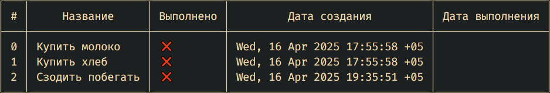

# BudgetTracker

📊 **BudgetTracker** — это простой и удобный трекер задач и бюджета, написанный на Go.  
Он позволяет отслеживать задачи, дату их создания и выполнения, а также статус выполнения.

---

## 🛠️ Возможности

- Добавление задач
- Отображение списка задач
- Отметка задач как выполненных
- Ведение временных меток (создания и выполнения)
- Хранение данных в SQLite
- CLI-интерфейс

---

## 📷 Пример интерфейса



---

## 🚀 Как запустить

```bash
go run main.go
```

---

## 📂 Структура проекта

```
.
├── main.go
├── tasks.go
├── database/
├── README.md
└── ...
```

## 🤝 Контакты

**Ilya Makarov**  
GitHub: [@IlyaMakar](https://github.com/IlyaMakar)
Проект открыт для фидбэка и Pull Request'ов!

---

# BudgetTracker

📊 **BudgetTracker** is a simple and user-friendly task tracker written in Go.  
It helps you manage tasks with creation and completion timestamps and track their status.

---

## 🛠️ Features

- Add new tasks
- View task list
- Mark tasks as completed
- Track creation and completion dates
- Store data in SQLite
- CLI-based interface

---

## 📷 Interface Example


---

## 🚀 Getting Started

Make sure you have Go installed. Then run the application with:

```bash
go run main.go
```

> Replace `main.go` with the actual entry point if it's different in your project.

---

## 📂 Project Structure

```
.
├── main.go
├── tasks.go
├── database/
├── README.md
└── 2ed16bd7-af5e-4304-baf1-1bb38fa58a59.png
```

---

## 🤝 Author

**Ilya Makarov**  
GitHub: [@IlyaMakar](https://github.com/IlyaMakar)

Open to feedback and pull requests!
